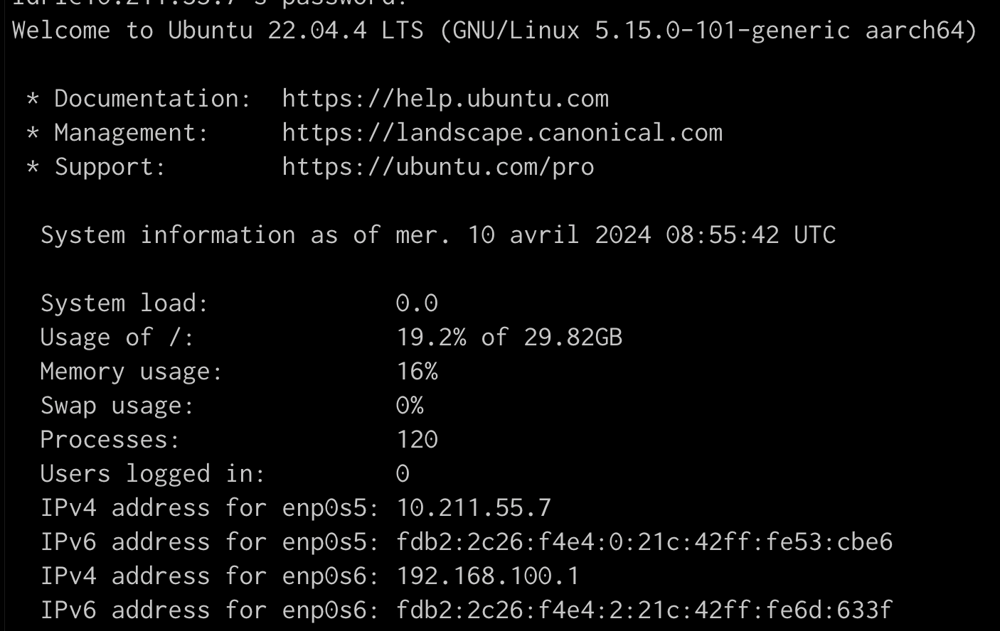
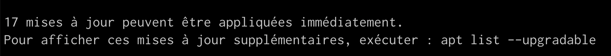

# Monitoring

Some monitoring tools: htop, bashtop, ...

## Learning objective
+ Write a monitoring script 
+ Bash / Python scripting 
+ Monitoring system resources

## Requirements
+ Make an interactive curses interface (or similar) for your script.
+ Deploy your script on a machine you manage and use something like cron to execute once an hour.
+ Collect metrics every hour and store them in an CSV file.
+ If the state of the machine is critical (not enough ram, ...), notify yourself by mail.
+ Send yourself a system report once a week.
+ Script needs to be documented

+ [ ] Execute script once an hour
+ [ ] Store script info in an CSV file
+ [ ] Send email from the CLI
+ [ ] Make a system report and send it once a week


## Which data & metrics do we want to collect ?

### Information on the general system

When connecting via ssh to my server, I have the following information about my system and it seems like it's a good basis for my monitoring script.




---

### Information to display on the script

* General information about the script
* Title, date & hour
* General information about the system
    * OS + other info
    * System load
    * Disk usage
    * Memory usage
* Running services
* Processes
    * Number of processes
    * Memory intensive process
* Network
    * Network status
    * IP addresses
* User activity 
    * Users logged in
    * Last failed login attempts
* Available updates 

## Script explanation

#### Date 
```bash
echo "# Server monitoring report - $(date '+%d-%m-%Y %H:%M:%S')"
```

## Store metrics to a CSV file
I guess I'll echo the metrics (the ones that change) to a CSV file

## Send myself an email
?? one thing at a time I guess

## Make it fancier

https://en.wikipedia.org/wiki/Curses_(programming_library)
https://github.com/metal3d/bashsimplecurses
https://bashsimplecurses.readthedocs.io/en/master/

## For sport
Write the script in python